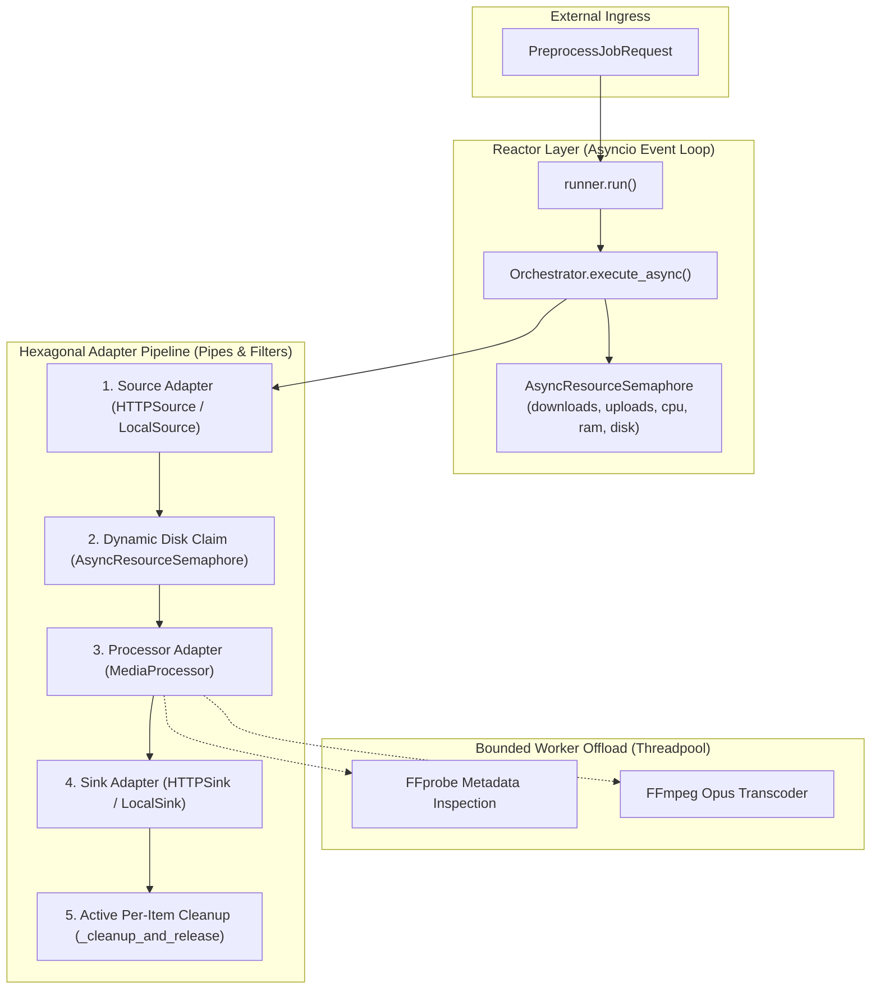
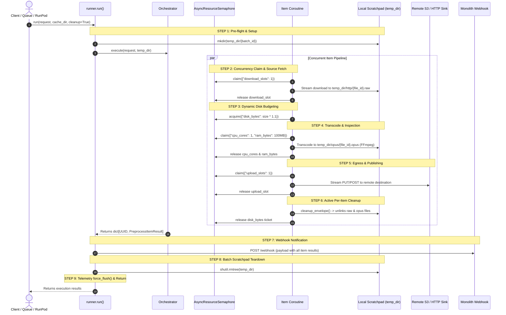

# Tadween Preprocess - Production Guide & Architecture Deep Dive

This document provides operational guidance, execution lifecycle timelines, storage architecture deep dives, tuning matrices, and troubleshooting techniques for running `tadween_preprocess` in production environments (such as serverless container runtimes: RunPod, Modal, AWS ECS/Fargate/Lambda, GCP Cloud Run, or custom Kubernetes workers).

---

## Table of Contents
1. [Deployment Architecture](#1-deployment-architecture)
2. [Execution Lifecycle ("What Happens When")](#2-execution-lifecycle-what-happens-when)
3. [Two-Tier Storage & Cleanup Architecture](#3-two-tier-storage--cleanup-architecture)
4. [Source & Sink Ingestion Model & Discovery](#4-source--sink-ingestion-model--discovery)
5. [Environment Configuration & Tuning Matrix](#5-environment-configuration--tuning-matrix)
6. [Resource Backpressure Management](#6-resource-backpressure-management)
7. [Distributed Tracing & OpenTelemetry Setup](#7-distributed-tracing--opentelemetry-setup)
8. [Webhook Integration & Lifecycle](#8-webhook-integration--lifecycle)
9. [Failure Modes, Flagging & Recovery](#9-failure-modes-flagging--recovery)
10. [Operational Monitoring & Key Metrics](#10-operational-monitoring--key-metrics)

---

## 1. Deployment Architecture

`tadween_preprocess` implements the **Reactor with Bounded Worker Offload** pattern (Pipes-and-Filters over an async event loop):



* **Event Loop Reactor**: Concurrently orchestrates hundreds of lightweight per-item coroutines without thread context switching overhead.
* **Bounded Worker Pool**: Gated by `AsyncResourceSemaphore` to regulate physical CPU cores and RAM during FFprobe inspection and FFmpeg transcoding.
* **Decoupled Hexagonal Adapters**: Sources (`HTTPSource`, `LocalSource`), Processors (`MediaProcessor`), and Sinks (`HTTPSink`, `LocalSink`) are modular and swappable.

### Package Installation & Extras

* **Monolith / Client Dispatcher** (Schemas & validation only, zero heavy dependencies):
  ```bash
  pip install tadween-preprocess
  ```
* **Worker Runtime / Serverless Container** (Full pipeline engine, FFmpeg, HTTP streaming, telemetry):
  ```bash
  pip install "tadween-preprocess[worker]"
  ```
* **RunPod Serverless Worker**:
  ```bash
  pip install "tadween-preprocess[all]"
  ```

---

## 2. Execution Lifecycle ("What Happens When")

The following chronological timeline breaks down exactly what happens during a job run from invocation to exit:



### Chronological Step-by-Step Table

| Step | Phase | Function / Component | Description |
| :---: | :--- | :--- | :--- |
| **1** | **Pre-flight & Setup** | `runner.run` | Resolves cache base directory, creates isolated batch folder `cache_dir / {batch_id}`, and starts root OpenTelemetry span `{SERVICE_NAME}.pipeline`. |
| **2** | **Source Ingestion** | `HTTPSource` / `LocalSource` | Claims `download_slots: 1`. Downloads remote stream to `temp_dir/http/{file_id}.raw` or creates symlink in `temp_dir/local/{file_id}.ext`. Releases slot. |
| **3** | **Disk Reservation** | `Orchestrator` | Measures raw file size and claims `disk_bytes = int(size * get_disk_multiplier())` from semaphore. If size exceeds total capacity, item fails fast on `resource_acquisition`. |
| **4** | **Transcoding & Inspection** | `MediaProcessor` | Claims `cpu_cores: 1, ram_bytes: 100MB`. Offloads FFprobe inspection and FFmpeg Opus encoding to worker threads. Outputs to `temp_dir/opus/{file_id}.opus`. |
| **5** | **Sink Publishing** | `HTTPSink` / `LocalSink` | Claims `upload_slots: 1`. Streams compressed Opus output to destination S3/HTTP URL (PUT/POST) or writes to permanent destination path. |
| **6** | **Active Per-Item Cleanup** | `cleanup_envelope` (`adapters/utils.py`) | **Working-set compaction**: Under `asyncio.shield(...)`, asynchronously unlinks `file.raw` and `file.opus` temporary files and releases the disk ticket immediately. |
| **7** | **Webhook Notification** | `runner.notify_webhook` | Formats `PreprocessWebhookPayload` with all file results and dispatches to webhook URL with exponential backoff. |
| **8** | **Batch Scratchpad Teardown** | `runner.run` (`finally`) | Runs `shutil.rmtree(temp_dir)` to purge the batch directory, subdirectories (`http/`, `local/`, `opus/`), and any unexpected lingering artifacts. |
| **9** | **Telemetry Flush & Return** | `runner.run` | Telemetry exporter flushes remaining spans and counters to the collector, and returns the result dictionary to the caller. |

---

## 3. Two-Tier Storage & Cleanup Architecture

`tadween_preprocess` implements a dual-layer cleanup architecture to guarantee both **bounded disk usage during execution** and **zero filesystem residue on completion**.

### Why Both Cleanups Are Necessary

| Cleanup Layer | Location | When It Runs | Purpose | Without It... |
| :--- | :--- | :--- | :--- | :--- |
| **Active Per-Item Cleanup** | `orchestrator.py` (`cleanup_envelope`) | Immediately when an item finishes, fails, or is cancelled. | **Working-Set Compaction**: Unlinks downloaded raw files and converted Opus files as soon as they are uploaded. | ❌ **Disk Full Crash**: A batch of 100 files (5 GB) on a 1 GB disk crashes after 20 files because intermediates accumulate until batch end. |
| **Passive Batch Teardown** | `runner.py` (`shutil.rmtree`) | Once at the very end of the batch run after webhooks finish. | **Scratchpad Purge & Leak Prevention**: Removes directory structure and unreferenced/orphaned temp files. | ❌ **Directory/Inode Leaks**: Empty subdirectories and aborted temp files accumulate in `/tmp` over thousands of container jobs. |

### Mathematical Proof of Working-Set Compaction
- Total batch size: $N = 100$ files $\times 50\text{ MB} = 5\text{ GB}$.
- Bounded concurrency: $C = 4$ workers.
- Ephemeral container disk: $1\text{ GB}$.
- **With Per-Item Cleanup**: Peak disk usage is bounded to $C \times \text{file size} = 4 \times 50\text{ MB} = 200\text{ MB} < 1\text{ GB}$. The batch finishes without issue.

### Declarative Retention Flags
For local workflows or debugging, cleanup behavior can be customized declaratively:
- **`options.keep_raw = True`**: Prevents per-item cleanup from deleting the downloaded raw file.
- **`options.keep_converted = True`**: Prevents per-item cleanup from deleting the converted Opus file.
- **`run(..., cleanup=False)`**: Disables batch-level `shutil.rmtree(temp_dir)`, leaving the entire scratchpad directory intact for inspection.
- **`LocalSink(file_path=Path("/data/out.opus"))`**: Writes output directly to the user's permanent path outside `temp_dir`; both cleanup layers can purge `temp_dir` without touching the user's output.

---

## 4. Source & Sink Ingestion Model & Discovery

### 1. Remote S3 / HTTP Presigned URLs
```python
from tadween_preprocess.models import (
    HttpLocation,
    ItemContext,
    ItemOptions,
    PreprocessItem,
)

http_item = PreprocessItem(
    context=ItemContext(file_id=uuid.uuid4(), filename="audio.mp3"),
    source=HttpLocation(
        url="https://s3.amazonaws.com/bucket/in.mp3?AWSAccessKeyId=..."
    ),
    sink=HttpLocation(
        url="https://s3.amazonaws.com/bucket/out.opus?AWSAccessKeyId=...", method="PUT"
    ),
    options=ItemOptions(require_compression=True),
)
```

### 2. Local Filesystem (Zero-Network Copy)
```python
local_item = PreprocessItem(
    context=ItemContext(file_id=uuid.uuid4(), filename="audio.mp3"),
    source=LocalLocation(file_path=Path("/data/input/audio.mp3")),
    sink=LocalLocation(file_path=Path("/data/output/audio.opus")),
)
```

### 3. Local Directory Audio Scraping (`discovery.py`)
Automatically scan a local folder for all supported media files (`.mp3`, `.wav`, `.m4a`, `.flac`, `.opus`, etc.) and assemble a `PreprocessBatch`:

```python
from tadween_preprocess import create_batch_from_directory

batch = create_batch_from_directory(
    directory=Path("/media/recordings"),
    output_dir=Path("/media/compressed"),
    recursive=True,
)
```

---

## 5. Environment Configuration & Tuning Matrix

`tadween_preprocess` auto-detects system resources at runtime, but tuning environment variables for your specific hardware tier maximizes throughput.

### Sizing & Tuning Matrix

| Hardware Profile | Physical CPU Cores | Available RAM | Ephemeral Disk | `PREPROCESS_CPU_WORKERS` | `PREPROCESS_DOWNLOAD_WORKERS` | `PREPROCESS_UPLOAD_WORKERS` | `PREPROCESS_DISK_BUDGET_BYTES` |
| :--- | :---: | :---: | :---: | :---: | :---: | :---: | :---: |
| **Small Worker** (2 vCPU / 4 GB RAM) | 2 | 4 GB | 20 GB | `2` | `10` | `5` | `0` (Auto-detect ~16 GB) |
| **Standard Worker** (4 vCPU / 8 GB RAM) | 4 | 8 GB | 50 GB | `4` | `20` | `10` | `0` (Auto-detect ~40 GB) |
| **High-Throughput Worker** (8 vCPU / 16 GB RAM) | 8 | 16 GB | 100 GB | `8` | `40` | `20` | `0` (Auto-detect ~80 GB) |
| **Dedicated Heavy Worker** (16+ vCPU / 32 GB RAM) | 16+ | 32 GB | 200 GB | `16` | `80` | `40` | `0` (Auto-detect ~160 GB) |

### Key Environment Variables

* **`SERVICE_NAME`**: Microservice name used in telemetry spans and metrics (defaults to `tadween_preprocess`).
* **`PREPROCESS_CPU_WORKERS`**: Defaults to physical CPU cores (`os.cpu_count()`). Governs concurrent FFmpeg compression processes.
* **`PREPROCESS_DOWNLOAD_WORKERS`**: Defaults to `20`. Number of concurrent download I/O slots.
* **`PREPROCESS_UPLOAD_WORKERS`**: Defaults to `10`. Number of concurrent upload I/O slots.
* **`PREPROCESS_DISK_BUDGET_BYTES`**: Defaults to 80% of ephemeral disk capacity (or `0` to disable ceiling).
* **`PREPROCESS_DISK_MULTIPLIER`**: Defaults to `1.1`. Multiplier applied to raw file size when reserving disk quota for conversion output.
* **`PREPROCESS_RAM_BUDGET_MB`**: Defaults to 80% of host RAM.
* **`PREPROCESS_RAM_PER_CPU_MB`**: Defaults to `100` MB. RAM budget claimed per concurrent FFmpeg process.
* **`PREPROCESS_MAX_FILE_SIZE_MB`**: Defaults to `2048` (2 GB). Hard stream ceiling per file to protect against rogue payload sizes.

---

## 6. Resource Backpressure Management

`AsyncResourceSemaphore` strictly regulates 5 distinct resource dimensions to prevent resource exhaustion and race conditions:

1. **`download_slots`**: Throttles active HTTP download streams to avoid saturating network sockets.
2. **`disk_bytes`**: Dynamically claims estimated space before transcoding. If an oversized file demands more disk than total capacity, the item cleanly fails with `failed_step: "resource_acquisition"` without interrupting other items.
3. **`cpu_cores`**: Caps concurrent FFmpeg processes to the machine's physical CPU cores to prevent thrashing and high latency.
4. **`ram_bytes`**: Allocates memory budget per FFmpeg worker.
5. **`upload_slots`**: Throttles concurrent egress PUT/POST uploads.

---

## 7. Distributed Tracing & OpenTelemetry Setup

`tadween_preprocess` instruments distributed tracing and OpenTelemetry metrics with W3C trace context propagation.

### 1. Enabling OTLP Export in Production
```bash
TELEMETRY_ENABLED=true
ENVIRONMENT=production
SERVICE_NAME=tadween_preprocess
OTEL_EXPORTER_OTLP_ENDPOINT=https://your-otlp-collector:4317
OTEL_EXPORTER_OTLP_HEADERS=Authorization=Bearer your-api-key
```

### 2. Trace Span Hierarchy
* `{SERVICE_NAME}.pipeline`: Root execution span for the entire batch.
* `{SERVICE_NAME}.source`: Ingestion I/O latency and retry attempts.
* `{SERVICE_NAME}.processor`: FFprobe inspection and FFmpeg encoding.
* `{SERVICE_NAME}.sink`: Egress upload streaming or file writing.
* `{SERVICE_NAME}.webhook_notify`: Webhook notification delivery.

---

## 8. Webhook Integration & Lifecycle

`tadween_preprocess` dispatches webhook notifications using a synchronous, post-batch lifecycle model:

* **Post-Batch Completion**: The webhook fires immediately after all files in a batch have completed processing.
* **Guaranteed Delivery & Backoff**: Retries failed attempts up to `max_retries` (default: 3) with exponential backoff (`retry_delay_seconds * 2^(attempt-1)`).
* **Payload Structure**:
  ```json
  {
    "job_id": "9b1deb4d-3b7d-4bad-9bdd-2b0d7b3dcb6d",
    "files": {
      "a0eebc99-9c0b-4ef8-bb6d-6bb9bd380a11": {
        "status": "completed",
        "true_duration_seconds": 124.5,
        "true_size_bytes": 1048576,
        "error": null,
        "failed_step": null
      }
    }
  }
  ```

---

## 9. Failure Modes, Flagging & Recovery

`tadween_preprocess` implements a 3-tier status model:

| Status | Meaning | Typical Causes | Action Taken |
| :--- | :--- | :--- | :--- |
| `completed` | Successfully preprocessed and published. | Normal workflow. | Output written to destination sink. |
| `flagged` | File rejected due to validation rules or non-fatal anomalies. | 1. Size drift exceeded (`size_drift_exceeded`)<br>2. Duration drift exceeded (`duration_drift_exceeded`)<br>3. Corrupt/non-media file (`invalid_media_type`)<br>4. Missing audio stream in compression mode (`no_audio_stream`) | Processing halts gracefully; temporary files deleted; remaining batch items continue. |
| `failed` | Unrecoverable error during execution step. | 1. Source Download 404/403 (`failed_step: "source"`)<br>2. Resource capacity overflow (`failed_step: "resource_acquisition"`)<br>3. FFmpeg crash (`failed_step: "compress"`)<br>4. Sink Upload failure (`failed_step: "sink"`) | Error recorded on envelope; item marked failed; webhook reports failed step and error message. |

---

## 10. Operational Monitoring & Key Metrics

| Metric Name | Type | Description & Dimensions |
| :--- | :--- | :--- |
| `{SERVICE_NAME}.batches` | Counter | Total batches processed. Dimensions: `outcome="success"` or `outcome="unhandled_error"`. |
| `{SERVICE_NAME}.items` | Counter | Total items processed. Dimensions: `status="completed"`, `status="flagged"`, `status="failed"`. |
| `{SERVICE_NAME}.webhook_failures` | Counter | Total webhook notifications that exhausted all retry attempts. |
